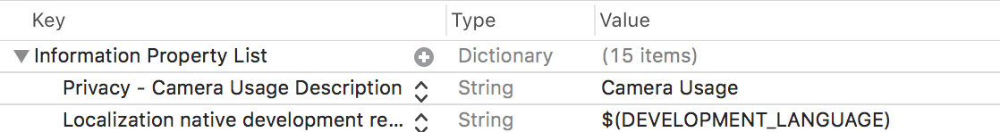

# IME Pay QR Scanner for iOS Apps

Scan QR Code issued by IME Pay to its merchants.

* Features
* Requirements
* Installation
* Usage
* License

## Features

- [x] Scan IME Pay merchant's QR Code
- [x] SDK Returns merchant's code and merchant name.

## Requirements

* iOS 8+

## Installation

### Cocoapods

To integrate Alamofire into your Xcode project using CocoaPods, specify it in your Podfile:

Say what the step will be

```
platform :ios, '11.4'
use_frameworks!

target '<Your Target Name>' do
    pod 'IMEPayQRScanner'
end
```

Then, run the following command:

```
$ pod install
```

## Usage

For iOS 10+, you have to provide camera ussage description, for that you'll need to add the Privacy - Camera Usage Description (NSCameraUsageDescription) field in your Info.plist:



```
let viewController = Your view controller from which scanner is opened

let coordinator = IMPScannerCoordinator(parentViewController: viewController)

```
```
coordinator.onScanSuccess  = { name, mobileNumOrCode in
       print("Merchant Name \(name ?? "")")
       print("Merchant Mobile Number / Code \(mobileNumOrCode ?? "")") // Use this for transactions
}
        
coordinator.onScanFailure = {
       print("Scanner failure message \($0 ?? "")")
}
coordinator.start()
```

## License

Alamofire is released under the MIT license. [See LICENSE](https://github.com/imepay/IMEPayQRScanner_iOS/blob/master/LICENSE) for details.
